<p align="center">
  
</p>

<p align="center">
  <a href="https://git.io/typing-svg"></a>
</p>

<p align="center">
  <a href="https://www.linkedin.com/in/malik-mobarek-829416311/"></a>
  <a href="https://www.instagram.com/malik_drw/"></a>
  <a href="mailto:your-email@example.com"></a>
  
</p>

<br/>

<!-- ═══════════════════════════════ ABOUT ME ═══════════════════════════════ -->

 **About Me**

```yaml
name: Malik Mobarek
location: France
education: Computer Science - Networks & Cybersecurity
current_focus:
  - Cybersecurity & Ethical Hacking
  - Network Architecture & Administration
  - Full-Stack Development
interests:
  - Capture The Flag (CTF) challenges
  - Building secure applications
  - Open Source contributions
motto: "Security is not a product, but a process."
```

<br/>

<!-- ═══════════════════════════════ TECH STACK ═══════════════════════════════ -->

<h2 align="center"> Tech Stack</h2>

<details open>
<summary><b>Languages</b></summary>
<br/>
<p align="center">
  
  
  
  
  
  
  
  
  
</p>
</details>

<details open>
<summary><b>Scripting & Shells</b></summary>
<br/>
<p align="center">
  
  
  
</p>
</details>

<details open>
<summary><b>Frameworks & Libraries</b></summary>
<br/>
<p align="center">
  
  
  
  
  
  
  
</p>
</details>

<details open>
<summary><b>Data Science & ML</b></summary>
<br/>
<p align="center">
  
  
  
  
  
  
</p>
</details>

<details open>
<summary><b>Databases</b></summary>
<br/>
<p align="center">
  
  
  
  
  
</p>
</details>

<details open>
<summary><b>DevOps & Infrastructure</b></summary>
<br/>
<p align="center">
  
  
  
  
  
  
  
</p>
</details>

<details open>
<summary><b>Networking & Security</b></summary>
<br/>
<p align="center">
  
  
  
</p>
</details>

<details open>
<summary><b>Tools</b></summary>
<br/>
<p align="center">
  
  
  
  
</p>
</details>

<br/>

<!-- ═══════════════════════════════ GITHUB STATS ═══════════════════════════════ -->

<h2 align="center"> GitHub Stats</h2>

<p align="center">
  <a href="https://github.com/malik-mb">
    
  </a>
  <a href="https://github.com/malik-mb">
    
  </a>
</p>

<p align="center">
  <a href="https://github.com/malik-mb">
    
  </a>
</p>

<!-- Activity Graph -->
<p align="center">
  <a href="https://github.com/malik-mb">
    
  </a>
</p>

<br/>

<!-- ═══════════════════════════════ TROPHIES ═══════════════════════════════ -->

<h2 align="center"> GitHub Trophies</h2>

<p align="center">
  
</p>

<br/>

<!-- ═══════════════════════════════ SNAKE ═══════════════════════════════ -->

<h2 align="center"> Contribution Snake</h2>

<p align="center">
  <picture>
    <source media="(prefers-color-scheme: dark)" srcset="https://raw.githubusercontent.com/malik-mb/malik-mb/output/github-snake-dark.svg"/>
    <source media="(prefers-color-scheme: light)" srcset="https://raw.githubusercontent.com/malik-mb/malik-mb/output/github-snake.svg"/>
    
  </picture>
</p>

<br/>

<!-- ═══════════════════════════════ TOP REPOS ═══════════════════════════════ -->

<h2 align="center"> Top Contributed Repos</h2>

<p align="center">
  
</p>

<br/>

<!-- ═══════════════════════════════ QUOTE ═══════════════════════════════ -->

<h2 align="center"> Dev Quote</h2>

<p align="center">
  
</p>

<br/>

<!-- ═══════════════════════════════ METRICS ═══════════════════════════════ -->

<h2 align="center"> Quick Metrics</h2>

<p align="center">
  
  
</p>

<br/>

<!-- ═══════════════════════════════ FOOTER ═══════════════════════════════ -->


<p align="center">
  
</p>

<p align="center">
  <b>Let's connect and build something amazing together!</b>
</p>
